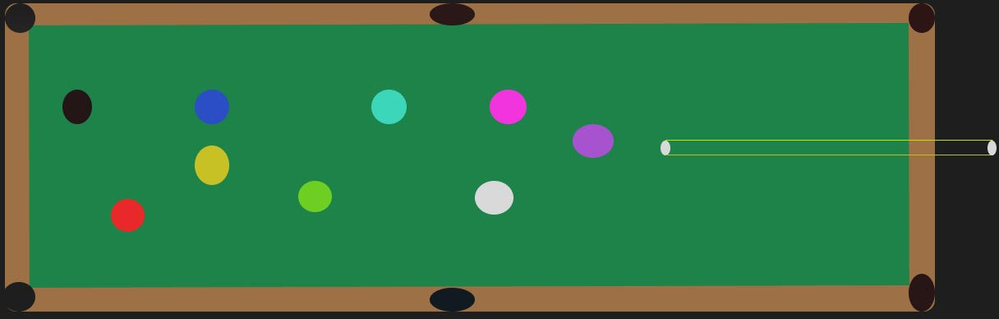

:warning: Everything between << >> needs to be replaced (remove << >> after replacing)

# << Pool Game>>
## CS110 Final Project  << Fall, 2023 >>

## Team Members

<< List team member names >>

Salman Naveed
Neil Abhichandani

## Project Description

<< Pool Gmae where a player is playing by himself and has to get all the balls in>>

## GUI Design

### Initial Design

### Final Design

## Program Design

### Features

1. << Feature 1 >>
2. << Feature 2 >>
3. << Feature 3 >>
4. << Feature 4 >>
5. << Feature 5 >>

### Classes

- << You should have a list of each of your classes with a description >>

## ATP
Test Case 1: Cue movement

Test Description: Verify if the cue follows your mouse cursor direction.
Test Steps:
Start the game.
Move around the cue to make sure its working.
Hold down the mouse and make sure you see lines to make sure cue is powering up.
Let go of the mouse for the cue to hit
Verify the white ball was hit by the cue
Expected Outcome: The cue will be able to hit the white which will break the balls

Test Case 2: Ball Collision Detection

Test Description: Ensure that collisions between the player's white ball and other balls are detected correctly.
Test Steps:
Start the game.
Use the cue to hit the white ball.
Verify that the white ball hits the other balls and they start moving.
Use white ball and see if it bounces of the wall when shot at the wall.
Verify that the ball was hit and bounced correctly back.
Expected Outcome: White ball should correctly collide with other balls.

Test Case 3: Game Won Condition

Test Description: Confirm that the game ends when the player puts all the balls in the hole.
Test Steps:
Start the game.
Play until the player puts all the balls in.
Verify that the game displays a "You Won" message.
Expected Outcome: The game should display a "You Won" message when the player puts all the balls in the hole.

Test Case 4: Game Lost Condition

Test Description: Confirm that the game ends when the player loosses all the lives.
Test Steps:
Start the game.
Play until the player looses all his lives by putting white ball in hole.
Verify that the game displays a "Game Over" message.
Expected Outcome: The game should display a "Game Over" message when the player looses all his lives.

Test Case 5: Ball Score Column

Test Description: Confirm that the column on the bottom tells you what balls you got in.
Test Steps:
Start the game.
Use the white ball to get the other balls in
Verify that the column on the bottome shows what ablls you got in in the order you got them in.
Expected Outcome: The game should display the balls you got in the order you got them in.